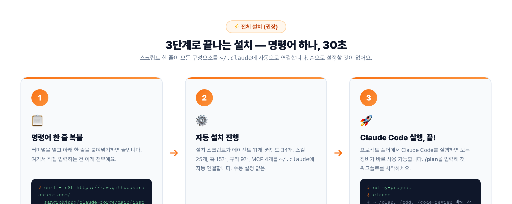
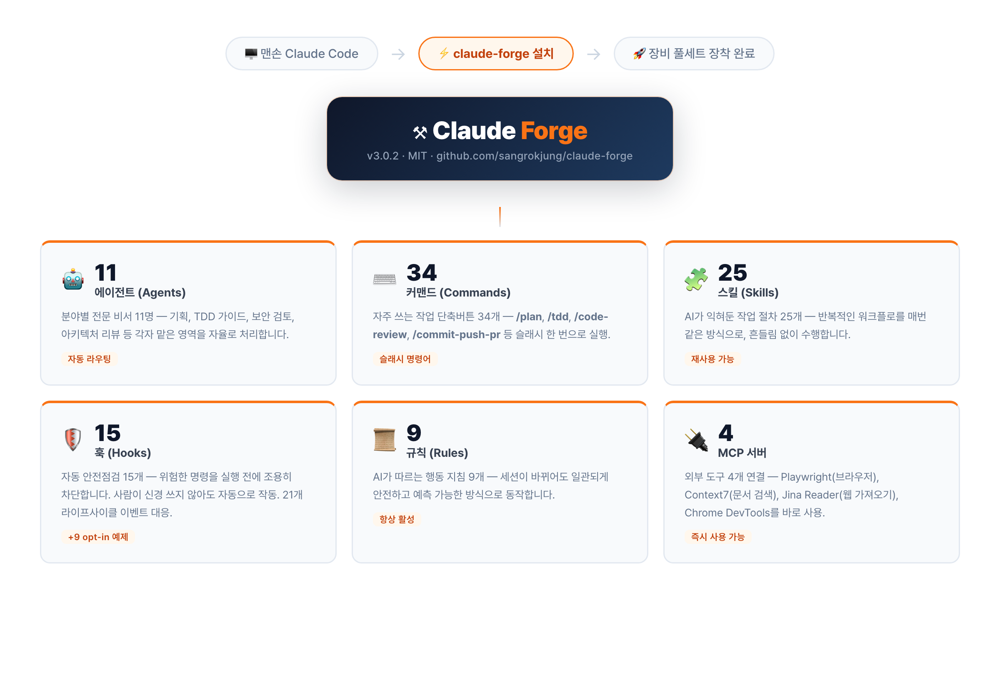
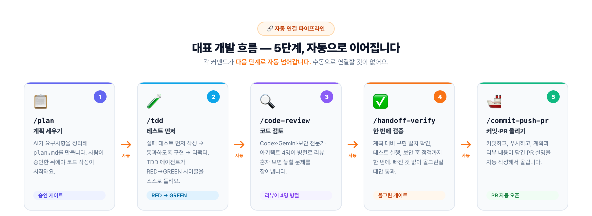
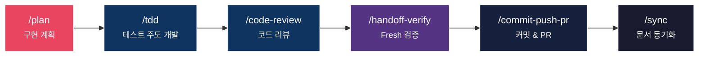
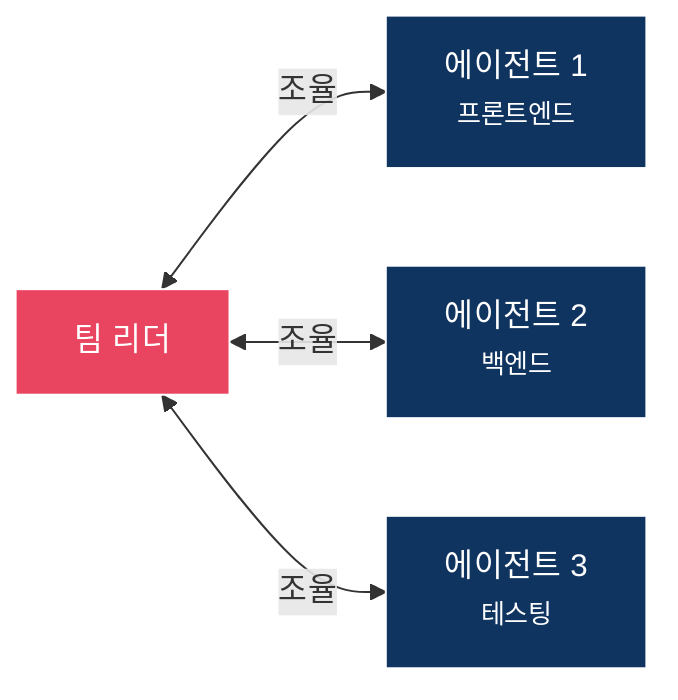
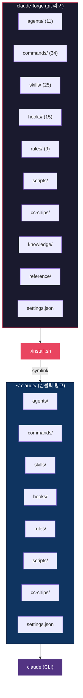

<picture>
  <source media="(prefers-color-scheme: dark)" srcset="docs/banner.jpg">
  <source media="(prefers-color-scheme: light)" srcset="docs/banner-light.jpg">
  
</picture>

<p align="center">
  <strong>Claude Code(AI 코딩 조수)에 전문 장비 풀세트를 한 번에 장착하는 프레임워크</strong>
</p>

<p align="center">
  <a href="LICENSE"></a>
  <a href="https://claude.com/claude-code"></a>
  <a href="https://github.com/sangrokjung/claude-forge/stargazers"></a>
  <a href="https://github.com/sangrokjung/claude-forge/network/members"></a>
  <a href="https://github.com/sangrokjung/claude-forge/graphs/contributors"></a>
  <a href="https://github.com/sangrokjung/claude-forge/commits/main"></a>
</p>

<p align="center">
  <a href="#-이게-뭔가요">이게 뭔가요?</a> &bull;
  <a href="#-어떻게-설치해요">설치</a> &bull;
  <a href="#-뭐가-들어있어요">구성 요소</a> &bull;
  <a href="#-어떻게-써요">사용법</a> &bull;
  <a href="#-v30-업데이트">v3.0 변경사항</a> &bull;
  <a href="README.md">English</a>
</p>

> 🎉 **v3.0.2 공개 (2026년 5월)** — Anthropic 2026 표준 완전 정렬 (훅(자동 안전점검) 21+ 이벤트 · 서브에이전트 v2 · 스킬/커맨드 하이브리드 정책) + 외부 도구 연결 최소 구성(4개: playwright · context7 · jina-reader · chrome-devtools). 상세: [MIGRATION.ko.md](MIGRATION.ko.md)

> 🚀 **한 줄 설치** (전체 설치, 권장):
> ```bash
> curl -fsSL https://raw.githubusercontent.com/sangrokjung/claude-forge/main/install.sh | bash
> ```
> 또는 Claude Code 세션 안에서: `/plugin marketplace add sangrokjung/claude-forge` → `/plugin install claude-forge` (부분 지원).

---

## 이게 뭔가요?

**Claude Code**(AI 코딩 조수)를 혼자 쓰면 기본기만 할 줄 아는 신입 직원과 같아요. **Claude Forge**는 그 신입에게 장비 풀세트 — 전문 비서 11명, 단축버튼 34개, 안전장치 15개 등 — 를 한 번에 장착해 줘요.

> 마치 터미널(명령창)을 꾸며주는 oh-my-zsh처럼, Claude Forge는 AI 코딩 조수를 파워 유저 도구로 업그레이드해요.

한 번 설치하면 아래가 모두 자동 연결돼 바로 쓸 수 있어요:

| 구성 | 숫자 | 쉽게 말하면 |
|:-----|:----:|:------------|
| **에이전트**(agents) | 11개 | 분야별 전문 비서 — 기획, 테스트, 보안검토, 아키텍처(시스템 설계) 등 |
| **커맨드**(commands) | 34개 | 자주 쓰는 작업 단축버튼 — `/plan`(계획), `/tdd`(테스트) 등 |
| **스킬**(skills) | 25개 | AI가 익혀둔 작업 절차 — 루프 자동화, 팀 오케스트레이션 등 |
| **훅**(hooks) | 15 + 예제 9개 | 자동 안전점검 — 위험한 명령 차단, API 키 유출 방지 등 |
| **규칙**(rules) | 9개 | AI가 따르는 행동 지침 — 코딩 스타일, 보안, 깃 워크플로우 등 |
| **MCP**(외부 도구 연결) | 4개 | 브라우저 자동화, 문서 검색, 웹 읽기, 크롬 개발자 도구 |

---

## 뭐가 좋아요?

### 계획부터 PR까지 자동으로 이어져요

`/plan` 하나로 AI가 구현 계획을 세우고, `/tdd`(테스트 주도 개발)로 테스트를 먼저 작성하고, `/code-review`로 코드를 검토하고, `/commit-push-pr`로 PR(코드 병합 요청)까지 만들어 줘요. 각 단계가 서로 자동으로 연결돼 있어요.

### 6겹 보안 안전망이 항상 켜져 있어요

코드를 짤 때마다 API 키 노출 방지 → 위험한 원격 명령 차단 → 파괴적 SQL(데이터베이스 삭제 명령) 차단 → 취약점 자동 탐지 → API 속도 제한 → 고비용 도구 경고가 자동으로 작동해요. 따로 신경 쓰지 않아도 돼요.

### 반복 작업을 슬래시 명령으로 박제할 수 있어요

`loop-forge`(루프 단조) 스킬로 자주 반복하는 작업 흐름을 한 줄짜리 `/명령어`로 만들어 두면 다음엔 그냥 입력만 하면 돼요.

### `git pull` 한 번이면 즉시 업데이트돼요

설치 방식이 심볼릭 링크(바로가기 연결) 기반이라, 새 버전이 나와도 `git pull` 한 줄로 끝이에요.

---

## 어떻게 설치해요?



설치 방법은 두 가지예요. 전체 기능이 필요하면 **방법 B(권장)**를 선택하세요.

### 방법 A — Claude Code 플러그인 (명령·스킬 일부만, 빠른 시작)

Claude Code 세션 안에서 두 줄 입력:

```
/plugin marketplace add sangrokjung/claude-forge
/plugin install claude-forge
```

업데이트: `/plugin update claude-forge`

> ⚠️ **주의**: 이 방법은 커맨드(단축버튼)와 일부 스킬만 연결돼요. 전문 비서(에이전트), 안전점검(훅), 규칙, 외부 도구 연결(MCP)은 연결되지 않아요. Claude Code 로더의 현재 정책 때문이에요. 전체 기능을 원하면 방법 B를 쓰세요.

<details>
<summary>방법 A vs 방법 B 상세 비교</summary>

| 구성 요소 | 방법 A (`/plugin install`) | 방법 B (`./install.sh`) |
|--------|:--------------------------:|:------------------------:|
| 커맨드 (34개)          | ✅ | ✅ |
| 스킬 (25개)            | ⚠️ 일부만                  | ✅ |
| 에이전트 (11개)        | ❌ | ✅ |
| 훅 (15개 + 예제 9개)   | ❌ | ✅ |
| 규칙 (9개)             | ❌ | ✅ |
| MCP 서버 (4개)         | ❌ | ✅ |
| 상태바 (CC CHIPS)      | ❌ | ✅ (선택) |
| settings.json 환경변수 | ❌ | ✅ |

</details>

---

### 방법 B — `install.sh` 전체 설치 (권장)

```bash
# 1. 코드 가져오기 (서브모듈은 선택 — 상태바만 해당)
git clone --recurse-submodules https://github.com/sangrokjung/claude-forge.git
cd claude-forge

# 2. 설치 (~/.claude 폴더에 바로가기 연결 생성)
./install.sh

# 3. Claude Code 실행
claude
```

설치 스크립트가 자동으로 해주는 것들:
1. 필요한 도구 확인 (node.js, jq, git)
2. 바로가기(심볼릭 링크) 생성 — `~/.claude/` 폴더에 전체 연결
3. 외부 도구(MCP 서버) 설치 선택
4. 셸 단축 명령 설정 (`cc`, `ccr`)

v2.1에서 올라오는 경우: `./install.sh --upgrade` (기존 설정 백업 후 안전하게 이전)

<details>
<summary>Windows 설치 방법</summary>

**WSL(Windows 리눅스 환경)**에서:
```bash
# WSL 네이티브 경로에 클론해야 바로가기 방식 가능
cd ~ && git clone --recurse-submodules https://github.com/sangrokjung/claude-forge.git
cd claude-forge && ./install.sh
```

**PowerShell**:
```powershell
.\install.ps1
```

</details>

<details>
<summary>사전 필요 도구</summary>

| 도구 | 용도 |
|:-----|:-----|
| **Node.js** | 외부 도구(MCP 서버) 실행 |
| **jq** | JSON(데이터 형식) 파싱 |
| **Git** | 코드 가져오기, 업데이트 |
| **Claude Code CLI** | `claude` 명령어 |

</details>

---

## 뭐가 들어있어요?



### 에이전트(agents) — 분야별 전문 비서 11명

| 이름 | 역할 |
|:-----|:-----|
| `planner` (기획자) | 복잡한 기능의 구현 계획 수립, 의존성·위험 분석 |
| `architect` (설계사) | 시스템 구조 설계, 확장성, 기술 의사결정 |
| `code-reviewer` (코드 검토자) | 코드를 보고 심각도별(CRITICAL/HIGH/MEDIUM) 이슈 분류 |
| `security-reviewer` (보안 검토자) | 보안 취약점 OWASP Top 10 기반 분석 |
| `tdd-guide` (테스트 가이드) | 테스트 먼저 작성 → 코드 구현 → 개선 사이클 안내 |
| `database-reviewer` (데이터베이스 검토자) | 데이터베이스 구조·쿼리 최적화 |
| `build-error-resolver` (빌드 오류 해결사) | 빌드 오류 즉시 수정 |
| `e2e-runner` (E2E 테스터) | 처음부터 끝까지 통합 테스트 생성·실행 |
| `refactor-cleaner` (코드 정리사) | 쓰지 않는 코드 제거, 중복 코드 정리 |
| `doc-updater` (문서 업데이터) | 문서·코드맵 자동 업데이트 |
| `verify-agent` (검증 에이전트) | 새 환경에서 빌드·테스트·린트를 독립 검증 |

<details>
<summary>에이전트 색상 체계 (UI 구분)</summary>

| 색상 | 의미 |
|:-----|:-----|
| **파란색(blue)** | 분석/리뷰 |
| **하늘색(cyan)** | 테스트/검증 |
| **노란색(yellow)** | 유지보수/데이터 |
| **빨간색(red)** | 보안/경고 |
| **자홍색(magenta)** | 크리에이티브/리서치 |
| **초록색(green)** | 비즈니스/성공 |

</details>

---

### 훅(hooks) — 자동 안전점검 15개

항상 켜져 있는 보안 6겹:

| 순서 | 훅 이름 | 막아주는 것 |
|:----:|:--------|:-----------|
| 1 | `output-secret-filter.sh` | 출력에 API 키·토큰이 노출되는 것 |
| 2 | `remote-command-guard.sh` | 위험한 원격 명령 실행 |
| 3 | `db-guard.sh` | 데이터베이스 파괴 SQL(DROP, TRUNCATE 등) |
| 4 | `security-auto-trigger.sh` | 코드 변경 시 자동 취약점 탐지 |
| 5 | `rate-limiter.sh` | API 과도한 호출 |
| 6 | `expensive-mcp-warning.sh` | 고비용 외부 도구 호출 경고 |

<details>
<summary>유틸리티 훅 9개 + Opt-in 예제 9개</summary>

**유틸리티 훅 (항상 켜짐)**:

| 훅 | 기능 |
|:---|:-----|
| `code-quality-reminder.sh` | 코드 품질 체크리스트 알림 |
| `context-sync-suggest.sh` | 컨텍스트(문맥 정보) 동기화 제안 |
| `forge-update-check.sh` | 세션 시작 시 프레임워크 업데이트 확인 |
| `mcp-usage-tracker.sh` | 외부 도구 사용량 추적 |
| `session-wrap-suggest.sh` | 세션 종료 시 정리 제안 |
| `task-completed.sh` | 작업 완료 알림 |
| `work-tracker-prompt.sh` | 작업 추적 프롬프트 |
| `work-tracker-stop.sh` | 작업 추적 종료 |
| `work-tracker-tool.sh` | 작업 추적 도구 |

**Opt-in 예제 (직접 활성화 가능)**:

`hooks/examples/`에 있는 `.example` 파일을 `.sh`로 바꾸고 `settings.json`에 등록하면 활성화돼요. SessionEnd(세션 종료), PreCompact(컴팩트 전), SubagentStart/Stop(서브에이전트 시작/종료), MessageStart/End(메시지 시작/끝), UserPromptReceived(사용자 입력 받음) 등 21가지 라이프사이클 이벤트(작동 시점)를 다뤄요. 전체 목록은 [`hooks/README.md`](hooks/README.md) 참고.

</details>

---

### MCP — 외부 도구 연결 4개 (기본)

| 도구 | 역할 |
|:-----|:-----|
| **playwright** | 브라우저(웹 창)를 코드로 자동 조작·테스트 |
| **context7** | 라이브러리·프레임워크 최신 문서를 실시간 조회 |
| **jina-reader** | URL(웹 주소)을 읽기 좋은 마크다운 텍스트로 변환 |
| **chrome-devtools** | Lighthouse 성능 측정, Core Web Vitals, 메모리 분석 (`@0.23.0`) |

<details>
<summary>선택 추가 가능한 도구들 (opt-in)</summary>

`mcp-servers.optional.json`에서 필요한 것만 골라 추가할 수 있어요:

| 서버 | API 키 필요 | 설명 |
|:-----|:----------:|:-----|
| **memory** | - | 세션 간 기억 유지 (Auto Memory로 대체 가능) |
| **fetch** | - | 웹 콘텐츠 가져오기 (`uvx` 필요) |
| **github** | ✅ | GitHub 리포/PR/이슈 관리 (`gh` CLI로 대체 가능) |
| **exa** | ✅ | AI 기반 웹 검색 (`WebSearch`로 대체 가능) |

</details>

---

## 어떻게 써요?



### 새 기능 개발 — 계획부터 PR까지

```
/plan → /tdd → /code-review → /handoff-verify → /commit-push-pr → /sync
```

<p align="center">
  
</p>



| 단계 | 커맨드 | 하는 일 |
|:----:|:-------|:--------|
| 1 | `/plan` | planner(기획) 에이전트가 구현 계획·의존성·위험을 분석해요 |
| 2 | `/tdd` | tdd-guide 에이전트가 테스트 먼저 → 코드 구현 → 개선 사이클을 안내해요 |
| 3 | `/code-review` | code-reviewer(코드 검토) 에이전트가 심각도별 이슈를 분류해요 |
| 4 | `/handoff-verify` | verify-agent(검증)가 새 환경에서 빌드·테스트·린트를 독립 검증해요 |
| 5 | `/commit-push-pr` | 커밋 메시지 작성, 원격 저장소 푸시, PR(병합 요청) 생성까지 자동화해요 |
| 6 | `/sync` | 프로젝트 문서(prompt_plan.md, spec.md, CLAUDE.md, rules)를 동기화해요 |

---

### 버그 수정

```
/explore → /tdd → /verify-loop → /quick-commit → /sync
```

| 단계 | 커맨드 | 하는 일 |
|:----:|:-------|:--------|
| 1 | `/explore` | 코드베이스(코드 전체)를 탐색해 원인을 파악해요 |
| 2 | `/tdd` | 실패 테스트를 먼저 작성하고 최소한의 수정으로 통과시켜요 |
| 3 | `/verify-loop` | 빌드·테스트를 반복 검증해 사이드 이펙트(의도치 않은 부작용)를 확인해요 |
| 4 | `/quick-commit` | 빠른 커밋(코드 저장) & 푸시(원격 반영) |
| 5 | `/sync` | 커밋 후 프로젝트 문서를 동기화해요 |

---

### 보안 감사

```
/security-review → /stride-analysis-patterns → /security-compliance
```

| 단계 | 커맨드 | 하는 일 |
|:----:|:-------|:--------|
| 1 | `/security-review` | security-reviewer(보안 검토) 에이전트가 OWASP Top 10 기반으로 분석해요 |
| 2 | `/stride-analysis-patterns` | STRIDE(위협 모델링 프레임워크)로 보안 위협을 분석해요 |
| 3 | `/security-compliance` | SOC2, GDPR 등 법적 보안 기준 준수 여부를 검증해요 |

---

### 팀 협업 — 멀티 에이전트

```
/orchestrate
```

<p align="center">
  
</p>



- 리더가 중심이 되어 여러 에이전트를 조율하는 **허브 앤 스포크** 방식이에요
- 각 에이전트가 맡은 파일을 독립적으로 처리해 **머지 충돌이 없어요**
- 단계별로 팀을 교체하는 **페이즈 기반 운영**도 가능해요

---

### 처음이신가요?

| 단계 | 할 일 |
|:----:|:------|
| 1 | 설치 후 `/guide` 실행 — 3분 인터랙티브 투어 |
| 2 | [첫 사용자 가이드](docs/FIRST-STEPS.md) 읽기 — 용어 사전 + TOP 6 커맨드 |
| 3 | [상황별 레시피](docs/WORKFLOW-RECIPES.md) 보기 — 복사해서 쓰는 5가지 시나리오 |

또는 `/auto 로그인 페이지 만들기`를 입력하면 계획부터 PR까지 알아서 진행해요.

---

## v3.0 업데이트

<details>
<summary><strong>v3.0 주요 변경사항 펼치기</strong></summary>

| 변경 | 설명 |
|:-----|:-----|
| **훅 21 이벤트** | 자동 안전점검이 5개에서 21개 라이프사이클 이벤트로 확장됐어요. 샘플: [`hooks/examples/`](hooks/examples/), 전체 목록: [`hooks/README.md`](hooks/README.md) |
| **서브에이전트 Frontmatter v2** | 에이전트 설정에 10개 선택 필드 추가: `isolation`(격리), `background`(배경 실행), `memory`(메모리), `maxTurns`(최대 턴) 등. 스키마: [`reference/agent-schema.json`](reference/agent-schema.json) |
| **스킬/커맨드 하이브리드 정책** | 스킬(자동 호출)과 커맨드(사용자 직접 입력)의 역할 구분 명문화. [`docs/SKILLS-VS-COMMANDS.md`](docs/SKILLS-VS-COMMANDS.md) |
| **MCP 최소 구성 (v3.0.1, 4개)** | 기본 외부 도구 4개로 최적화. 레거시 전체 세트는 [`mcp-servers.optional.json`](mcp-servers.optional.json) 보존 |
| **CLAUDE.md 템플릿 + @import** | [`setup/CLAUDE.md.template`](setup/CLAUDE.md.template) 신규. 모듈형 프로젝트 지침 구성 지원 |
| **settings.json 2026 필드** | `tui`(깜박임 없는 렌더링), `disableSkillShellExecution`(샌드박싱), `enabledMcpjsonServers`(명시적 허용 목록) |
| **원커맨드 업그레이드** | `./install.sh --upgrade` — 기존 v2.1 설치를 백업 및 diff 미리보기와 함께 안전하게 이전 |

**v3.0.1 추가 패치**:

| 변경 | 설명 |
|:-----|:-----|
| **플러그인 매니페스트** | `/plugin marketplace add sangrokjung/claude-forge`로 커맨드·스킬 사용 가능. CI가 버전 불일치 자동 차단 |
| **Chrome DevTools 승격** | Lighthouse / Core Web Vitals / 메모리 스냅샷이 기본 4개에 합류 |
| **훅 타이밍 기록** | SessionEnd 훅 실행 시점을 `~/.claude/logs/hook-timing.jsonl`에 기록하는 래퍼 신규 |
| **CI 트리거 확장** | 전 PR + `main`/`feat/**`/`fix/**`/`chore/**`/`docs/**`/`ci/**` 푸시에서 검증 실행 (총 6개 job) |

**v3.0에서 달라진 것 (주의)**:

- **MCP 기본 축소** — `memory`, `exa`, `github`, `fetch`가 기본에서 빠졌어요. 필요하면 [`mcp-servers.optional.json`](mcp-servers.optional.json)에서 복원하세요.
- **커맨드 8개가 `skills/`로 이동** — 바로가기 호환은 **2027-04-01**까지 유지돼요.
- **settings.json allowlist 변경** — `mcp__memory`, `mcp__exa`, `mcp__github`, `mcp__fetch` 제거. `mcp__playwright` 추가.

</details>

---

## 자주 묻는 질문

<details>
<summary><strong>/sync는 무엇을 하나요?</strong></summary>

`/sync`는 프로젝트 메모리(AI가 기억하는 정보)와 문서를 최신 상태로 맞춰줘요. 원격 저장소에서 최신 변경사항을 가져온 뒤, `prompt_plan.md`·`spec.md`·`CLAUDE.md`·규칙 파일을 모두 동기화해요. 워크플로우 완료 후 또는 새 세션 시작 시 실행하면 AI가 최신 맥락을 유지해요.

</details>

<details>
<summary><strong>Claude Forge는 세션 간 기억을 어떻게 관리하나요?</strong></summary>

4계층 메모리(기억) 시스템을 써요:

1. **프로젝트 문서** (`CLAUDE.md`, `prompt_plan.md`, `spec.md`) — 저장소에 영속하는 프로젝트 수준 지침과 계획. `/sync`로 최신 상태를 유지해요.
2. **규칙 파일** (`rules/`) — 코딩 스타일, 보안, 워크플로우 규칙이 매 세션마다 자동 로드돼요.
3. **MCP 메모리 서버** — 세션 간 영속하는 지식 그래프로 엔티티(개체)와 관계를 저장해요.
4. **에이전트 메모리** (`~/.claude/agent-memory/`) — 핵심 에이전트가 작업 후 학습 내용을 기록해 시간이 지날수록 추천 품질이 높아져요.

세션 시작 시 `/sync`를 실행하면 1·2계층이 최신 상태가 돼요. 3·4계층은 자동으로 유지돼요.

</details>

<details>
<summary><strong>에이전트를 직접 추가할 수 있나요?</strong></summary>

`agents/` 폴더에 YAML 앞머리(frontmatter)가 포함된 마크다운 파일을 만들면 돼요:

```markdown
---
name: my-agent
description: Use this agent when [트리거 조건]. Input: [입력]. Output: [출력].
tools: ["Read", "Grep", "Glob"]
model: sonnet
memory: project
color: blue
---

You are an expert [역할]. Your mission is to [목표].

## Process
1. [단계 1]
2. [단계 2]
```

지원 frontmatter 필드: `name`(필수), `description`(필수), `model`, `color`, `tools`, `memory`, `maxTurns`, `isolation`.
상세: [reference/agents-config-ref.md](reference/agents-config-ref.md)

</details>

<details>
<summary><strong>슬래시 커맨드(단축버튼)를 직접 추가할 수 있나요?</strong></summary>

`commands/` 폴더에 마크다운 파일을 만들기만 하면 돼요:

```markdown
# my-command.md

/my-command 실행 시 수행할 작업을 기술합니다.
```

</details>

<details>
<summary><strong>보안 훅(안전점검)을 직접 추가할 수 있나요?</strong></summary>

`hooks/` 폴더에 쉘 스크립트를 만들고 `settings.json`에 등록하면 돼요:

```bash
#!/bin/bash
# hooks/my-guard.sh
# PreToolUse, PostToolUse 등 특정 이벤트(작동 시점)에서 실행됩니다.
```

</details>

---

## 전체 목록 (개발자용 상세)

<details>
<summary><strong>전체 커맨드 목록 (34개)</strong></summary>

| 커맨드 | 설명 |
|:-------|:-----|
| `/agent-router` | 전문 에이전트 자동 라우팅 |
| `/auto` | 계획부터 PR까지 원버튼 자동 실행 |
| `/build-fix` | 빌드 오류 자동 수정 |
| `/checkpoint` | 현재 상태 체크포인트 저장 |
| `/code-review` | 방금 작성한 코드를 보안+품질 검사 |
| `/commit-push-pr` | 커밋, 푸시, PR 생성 자동화 |
| `/e2e` | E2E 테스트 실행 |
| `/eval` | 코드 모델 평가 |
| `/explore` | 코드베이스를 탐색하여 구조 파악 |
| `/forge-update` | Claude Forge 프레임워크를 최신 버전으로 업데이트 |
| `/guide` | 처음 사용자를 위한 3분 인터랙티브 가이드 |
| `/handoff-verify` | 빌드/테스트/린트 한 번에 자동 검증 |
| `/init-project` | 프로젝트 초기 설정 |
| `/learn` | 학습 및 지식 축적 |
| `/loop-forge` | 반복 작업을 재사용 가능한 자가검증 슬래시 명령으로 박제 |
| `/next-task` | 다음 작업 할당 |
| `/orchestrate` | Agent Teams 멀티 에이전트 구성 |
| `/plan` | AI가 구현 계획을 세워줍니다 |
| `/pull` | 원격 변경사항 가져오기 |
| `/quick-commit` | 빠른 커밋 & 푸시 |
| `/refactor-clean` | 리팩토링 및 코드 정리 |
| `/security-review` | 보안 리뷰 실행 |
| `/show-setup` | 설치 상태와 프로젝트 정보 보기 |
| `/suggest-automation` | 자동화 기회 제안 |
| `/sync` | 최신 변경사항 풀 + 프로젝트 문서 동기화 |
| `/sync-docs` | 문서 동기화 |
| `/tdd` | 테스트 먼저 만들고 코드 작성 |
| `/test-coverage` | 테스트 커버리지 분석 |
| `/update-codemaps` | 코드맵 업데이트 |
| `/update-docs` | 문서 업데이트 |
| `/verify-loop` | 빌드·테스트 반복 검증 |
| `/web-checklist` | 웹 체크리스트 검사 |
| `/worktree-cleanup` | 워크트리 정리 |
| `/worktree-start` | 워크트리 시작 |

</details>

<details>
<summary><strong>전체 스킬 목록 (25개)</strong></summary>

| 스킬 | 설명 |
|:-----|:-----|
| `build-system` | 빌드 시스템 구성 및 관리 |
| `cache-components` | 캐시 컴포넌트 패턴 |
| `cc-dev-agent` | Claude Code 개발 에이전트 워크플로우 |
| `continuous-learning-v2` | 지속적 학습 및 진화 시스템 |
| `debugging-strategies` | 디버깅 전략 가이드 |
| `dependency-upgrade` | 의존성 업그레이드 관리 |
| `eval-harness` | LLM 평가 하네스 |
| `evaluating-code-models` | 코드 모델 벤치마크 |
| `evaluating-llms-harness` | LLM 하네스 평가 |
| `extract-errors` | 오류 추출 및 분석 |
| `frontend-code-review` | 프론트엔드 코드 리뷰 |
| `loop-forge` | 반복 작업 한 줄을 재사용 가능한 자가검증 슬래시 명령으로 박제 (5개 루프 원형 + verifier·하드스톱 자동) |
| `manage-skills` | 스킬 관리 도구 |
| `prompts-chat` | 프롬프트 채팅 |
| `security-compliance` | 보안 컴플라이언스 검증 |
| `security-pipeline` | 보안 파이프라인 |
| `session-wrap` | 세션 정리 및 래핑 |
| `skill-factory` | 스킬 생성 팩토리 |
| `strategic-compact` | 전략적 컴팩트 |
| `stride-analysis-patterns` | STRIDE 위협 모델링 |
| `summarize` | 코드/문서 요약 |
| `team-orchestrator` | 팀 오케스트레이터 |
| `using-superpowers` | 스킬 발견 및 사용 가이드 |
| `verification-engine` | 검증 엔진 |
| `verify-implementation` | 구현 검증 |

</details>

<details>
<summary><strong>아키텍처 — 심볼릭 링크(바로가기) 구조</strong></summary>

> **스킬 vs 커맨드** — `skills/`는 AI가 자동으로 찾아 쓰는 지식과 재사용 워크플로우예요. `commands/`는 사용자가 `/이름`을 직접 입력해 타이밍을 결정하는 명령이에요. 정책 상세: [docs/SKILLS-VS-COMMANDS.md](docs/SKILLS-VS-COMMANDS.md)

<p align="center">
  
</p>



**전체 디렉토리 구조**:

```
claude-forge/
  ├── .claude-plugin/            플러그인 매니페스트
  ├── .github/workflows/         CI 검증
  ├── agents/                    에이전트 정의 (11 .md, frontmatter v2)
  ├── cc-chips/                  상태바 서브모듈
  ├── cc-chips-custom/           커스텀 상태바 오버레이
  ├── commands/                  슬래시 커맨드 (34 .md, 8개는 skills/로 이동)
  ├── docs/                      스크린샷, 다이어그램, 정책 문서
  ├── hooks/                     이벤트 기반 스크립트 (15)
  │   └── examples/              21 lifecycle 이벤트 샘플 opt-in (9)
  ├── knowledge/                 지식 베이스
  ├── reference/                 참조 문서 (+ agent-schema.json)
  ├── rules/                     자동 로드 규칙 파일 (9)
  ├── scripts/                   유틸리티 스크립트
  ├── setup/                     설치 가이드 + CLAUDE.md 템플릿
  ├── skills/                    다단계 스킬 워크플로우 (25, 하이브리드 정책)
  ├── install.sh                 macOS/Linux 설치 (--upgrade 지원)
  ├── install.ps1                Windows 설치 (--upgrade 지원)
  ├── mcp-servers.json           MCP 기본 설정 (4 minimal)
  ├── mcp-servers.optional.json  MCP 선택 서버
  ├── settings.json              Claude Code 설정 (2026 필드)
  ├── MIGRATION.md               v2.1 → v3.0 이전 가이드 (EN)
  ├── MIGRATION.ko.md            v2.1 → v3.0 이전 가이드 (KO)
  ├── CONTRIBUTING.md            기여 가이드
  ├── SECURITY.md                보안 정책
  └── LICENSE                    MIT 라이선스
```

</details>

<details>
<summary><strong>커스터마이징 — 설정 오버라이드</strong></summary>

추적되는 파일을 수정하지 않고 개인 설정을 오버라이드(덮어쓰기)할 수 있어요:

```bash
# 로컬 오버라이드 파일 생성 (git-ignored, 개인 설정)
cp setup/settings.local.template.json ~/.claude/settings.local.json

# 개인 시크릿·환경설정 편집
vim ~/.claude/settings.local.json
```

`settings.local.json`은 Claude Code가 `settings.json` 위에 자동으로 합쳐줘요.

</details>

---

## 기여하기

에이전트, 커맨드, 스킬, 훅 추가 방법은 [CONTRIBUTING.md](CONTRIBUTING.md)를 참조하세요.

---

## Claude Forge를 사용하시나요? 배지를 달아주세요!

```markdown
[](https://github.com/sangrokjung/claude-forge)
```

이 배지를 프로젝트 README에 추가하면 Claude Forge 사용을 알릴 수 있어요.

---

## Contributors

<a href="https://github.com/sangrokjung/claude-forge/graphs/contributors">
  
</a>

---

## 라이선스

[MIT](LICENSE) — 자유롭게 사용, 포크, 확장하세요.

---

<p align="center">
  <sub>Made with ❤️ by <a href="https://github.com/sangrokjung">QJC (Quantum Jump Club)</a></sub>
</p>
