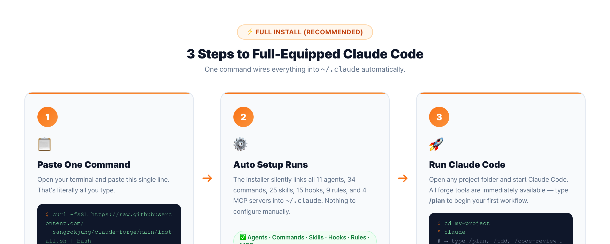
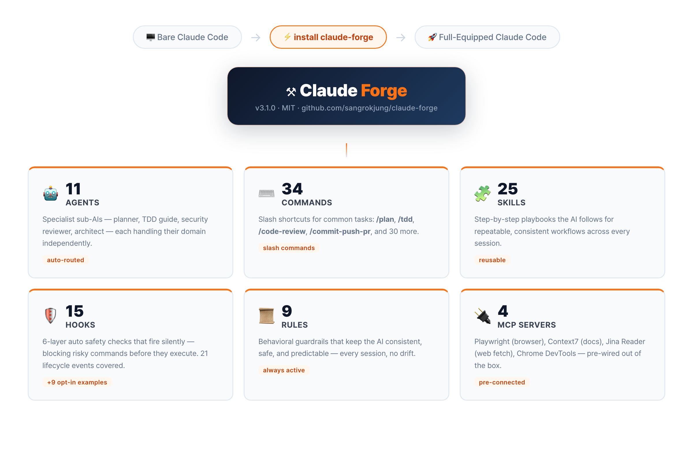
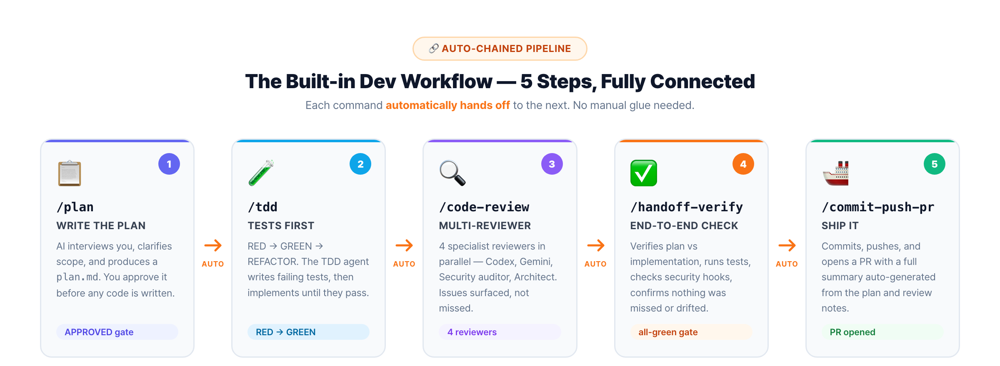
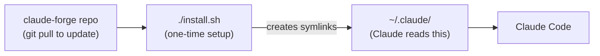

<picture>
  <source media="(prefers-color-scheme: dark)" srcset="docs/banner.jpg">
  <source media="(prefers-color-scheme: light)" srcset="docs/banner-light.jpg">
  
</picture>

<p align="center">
  <strong>oh-my-zsh for Claude Code — one install, full professional kit</strong>
</p>

<p align="center">
  <a href="LICENSE"></a>
  <a href="https://claude.com/claude-code"></a>
  <a href="https://github.com/sangrokjung/claude-forge/stargazers"></a>
  <a href="https://github.com/sangrokjung/claude-forge/network/members"></a>
  <a href="https://github.com/sangrokjung/claude-forge/graphs/contributors"></a>
  <a href="https://github.com/sangrokjung/claude-forge/commits/main"></a>
</p>

<p align="center">
  <a href="#what-is-claude-forge">What is it?</a> &bull;
  <a href="#-why-bother">Why bother?</a> &bull;
  <a href="#-install-in-minutes">Install</a> &bull;
  <a href="#-whats-inside">What's inside</a> &bull;
  <a href="#-how-to-use-it">How to use</a> &bull;
  <a href="#-architecture">Architecture</a> &bull;
  <a href="#-faq">FAQ</a> &bull;
  <a href="README.ko.md">한국어</a>
</p>

> **v3.1.0 released (June 2026)** — Adds **loop-forge** (turn a repetitive task into a reusable, self-guarding slash command) and a full beginner-friendly rewrite of this README with diagrams. Built on v3.0.2 (LLM-readable install) and v3.0.1 (Anthropic 2026 standard alignment: Hooks 21+ events, Subagent frontmatter v2, Skills/Commands hybrid policy, 4-server MCP minimum). See [MIGRATION.md](MIGRATION.md).

---

## What is Claude Forge?

**Plain English version:** Claude Code is an AI coding assistant that lives in your terminal. Out of the box it is capable but bare — like a new employee who knows how to code but has no company procedures, no safety checklists, no templates, and no specialist colleagues to call on.

Claude Forge is the **equipment pack** for that assistant. One install gives it:

- 11 specialist "colleagues" (agents) it can delegate to — planner, security reviewer, TDD guide, and more
- 34 one-word shortcuts (commands like `/plan`, `/tdd`, `/code-review`) that trigger full workflows
- 25 saved procedures (skills) it follows automatically
- 15 safety checks (hooks) that run silently in the background every time it touches your code
- 9 rule files that define how it should behave
- 4 external tool connections (browser automation, live docs search, and more)

> **The oh-my-zsh analogy:** oh-my-zsh is a free add-on that turns a plain terminal into a colorful, plugin-packed power tool — without changing what the terminal fundamentally does. Claude Forge does the same thing for Claude Code.

---

## ✨ Why bother?

| Without Claude Forge | With Claude Forge |
|:---------------------|:-----------------|
| Claude Code writes code, but you have to remind it about tests, security, and docs every time | Automated pipeline: plan → test → review → verify → ship, all connected |
| No safety net — Claude can run dangerous commands or leak secrets by accident | 6-layer hook system blocks risky actions before they happen |
| One AI doing everything alone | 11 specialist agents working in parallel (planner, architect, security reviewer…) |
| Hours assembling your own config | 5-minute install, everything pre-wired |
| Updates require manual copy-paste | `git pull` — done |

---

## 📥 Install in Minutes



### Option A — Claude Code Plugin (quick start, partial features)

Open a Claude Code session and run two commands:

```
/plugin marketplace add sangrokjung/claude-forge
/plugin install claude-forge
```

This gets you commands and most skills right away. Agents, hooks, rules, and MCP connections need Option B.

Update later: `/plugin update claude-forge`

### Option B — Full Install (recommended, everything included)

One line in your terminal:

```bash
curl -fsSL https://raw.githubusercontent.com/sangrokjung/claude-forge/main/install.sh | bash
```

Or if you prefer to clone first:

```bash
git clone --recurse-submodules https://github.com/sangrokjung/claude-forge.git
cd claude-forge
./install.sh        # fresh install
# or
./install.sh --upgrade   # safe migration from v2.1
```

**Windows users:** Run `.\install.ps1` in PowerShell as Administrator.

### Which option should I pick?

| What you get | Option A (`/plugin install`) | Option B (`./install.sh`) |
|:-------------|:----------------------------:|:-------------------------:|
| Commands (34 shortcuts)        | ✅ | ✅ |
| Skills (25 saved procedures)   | ⚠️ partial | ✅ |
| Agents (11 specialists)        | ❌ | ✅ |
| Hooks (15 safety checks)       | ❌ | ✅ |
| Rules (9 behavior guidelines)  | ❌ | ✅ |
| MCP connections (4 tools)      | ❌ | ✅ |

**Recommendation:** Use Option B unless you only need a taste of commands and skills.

> If Claude Forge helps you, a [star on GitHub](https://github.com/sangrokjung/claude-forge/stargazers) helps others find it.

---

## 📦 What's Inside



Here is everything bundled in Claude Forge, explained in plain language:

| What | Count | Plain English |
|:-----|:-----:|:--------------|
| **Agents** (specialist colleagues) | 11 | Each one is an AI focused on a single job — planner, architect, security checker, test guide, database expert, and more. Claude calls the right one automatically. |
| **Commands** (shortcut buttons) | 34 | Type `/plan` and Claude creates a full implementation plan. Type `/tdd` and it writes tests first, then code. All 34 are pre-built shortcuts for common developer tasks. |
| **Skills** (saved procedures) | 25 | Step-by-step playbooks Claude follows automatically — like a recipe it has memorized. `loop-forge` turns any repetitive task into a reusable slash command in seconds. |
| **Hooks** (silent safety checks) | 15 built-in + 9 opt-in examples | These run before and after every action Claude takes. They block leaked passwords, dangerous database commands, and unsafe remote scripts — without you having to think about it. Covers 21 lifecycle events. |
| **Rules** (behavior guidelines) | 9 | Written instructions Claude reads at the start of every session — coding style, security principles, git workflow conventions, and more. |
| **MCP connections** (external tools) | 4 | Browser automation (Playwright), live library docs (context7), web page reader (jina-reader), and Chrome DevTools for performance audits. |

<details>
<summary><strong>Full list: 11 Agents</strong></summary>

#### Deep Analysis Agents (use the most capable model)

| Agent | What it does |
|:------|:-------------|
| **planner** | Creates detailed implementation plans for complex features. Waits for your sign-off before any code is written. |
| **architect** | Designs system structure, makes scalability decisions, reviews technical architecture. |
| **code-reviewer** | Checks code quality, security, and maintainability after you write it. |
| **security-reviewer** | Scans for OWASP Top 10 vulnerabilities, leaked secrets, injection risks. |
| **tdd-guide** | Enforces test-first development: RED (failing test) → GREEN (passing) → IMPROVE (refactor). |
| **database-reviewer** | Optimizes PostgreSQL/Supabase queries, reviews schema design. |

#### Fast Execution Agents (use a quicker model)

| Agent | What it does |
|:------|:-------------|
| **build-error-resolver** | Fixes TypeScript and build errors with minimal changes to surrounding code. |
| **e2e-runner** | Generates and runs Playwright end-to-end browser tests. |
| **refactor-cleaner** | Finds and removes dead code using knip, depcheck, ts-prune. |
| **doc-updater** | Keeps documentation and code maps in sync after changes. |
| **verify-agent** | Opens a fresh context to verify build, lint, and tests all pass — like a second pair of eyes. |

</details>

<details>
<summary><strong>Full list: 34 Commands</strong></summary>

#### Core Workflow

| Command | What it does |
|:--------|:------------|
| `/plan` | AI creates an implementation plan. Waits for your confirmation before coding. |
| `/tdd` | Write tests first, then code. One unit of work at a time. |
| `/code-review` | Security + quality check on the code you just wrote. |
| `/handoff-verify` | Auto-verify build/test/lint all at once. |
| `/commit-push-pr` | Commit, push, create PR, and optionally merge — all in one. |
| `/quick-commit` | Fast commit for simple, well-tested changes. |
| `/verify-loop` | Auto-retry build/lint/test up to 3x with auto-fix. |
| `/auto` | One-button automation: plan to PR without stopping. |
| `/guide` | Interactive 3-minute tour for first-time users. |
| `/loop-forge` | Turn a repetitive task into a reusable, self-guarding slash command. |

#### Exploration & Analysis

| Command | What it does |
|:--------|:------------|
| `/explore` | Navigate and analyze codebase structure. |
| `/build-fix` | Incrementally fix TypeScript and build errors. |
| `/next-task` | Recommend next task based on project state. |
| `/suggest-automation` | Analyze repetitive patterns and suggest automation. |

#### Security

| Command | What it does |
|:--------|:------------|
| `/security-review` | CWE Top 25 + STRIDE threat modeling. |
| `/stride-analysis-patterns` | Systematic STRIDE methodology for threat identification. |
| `/security-compliance` | SOC2, ISO27001, GDPR, HIPAA compliance checks. |

#### Testing & Evaluation

| Command | What it does |
|:--------|:------------|
| `/e2e` | Generate and run Playwright end-to-end tests. |
| `/test-coverage` | Analyze coverage gaps and generate missing tests. |
| `/eval` | Eval-driven development workflow management. |
| `/evaluating-code-models` | Benchmark code generation models (HumanEval, MBPP). |
| `/evaluating-llms-harness` | Benchmark LLMs across 60+ academic benchmarks. |

#### Documentation & Sync

| Command | What it does |
|:--------|:------------|
| `/update-codemaps` | Analyze codebase and update architecture docs. |
| `/update-docs` | Sync documentation from source-of-truth. |
| `/sync-docs` | Sync prompt_plan.md, spec.md, CLAUDE.md + rules. |
| `/sync` | Pull latest changes and sync all project docs. Use after any workflow or at session start. |
| `/pull` | Quick `git pull origin main`. |

#### Project Management

| Command | What it does |
|:--------|:------------|
| `/init-project` | Scaffold new project with standard structure. |
| `/orchestrate` | Agent Teams parallel orchestration. |
| `/checkpoint` | Save/restore work state. |
| `/learn` | Record lessons learned + suggest automation. |
| `/web-checklist` | Post-merge web testing checklist. |

#### Refactoring & Debugging

| Command | What it does |
|:--------|:------------|
| `/refactor-clean` | Identify and remove dead code with test verification. |
| `/debugging-strategies` | Systematic debugging techniques and profiling. |
| `/dependency-upgrade` | Major dependency upgrades with compatibility analysis. |
| `/extract-errors` | Extract and catalog error messages. |

#### Git Worktree

| Command | What it does |
|:--------|:------------|
| `/worktree-start` | Create git worktree for parallel development. |
| `/worktree-cleanup` | Clean up worktrees after PR completion. |

#### Utilities

| Command | What it does |
|:--------|:------------|
| `/summarize` | Summarize URLs, podcasts, transcripts, local files. |

</details>

<details>
<summary><strong>Full list: 25 Skills</strong></summary>

| Skill | What it does |
|:------|:------------|
| **build-system** | Auto-detect and run project build systems. |
| **cache-components** | Next.js Cache Components and Partial Prerendering (PPR) guidance. |
| **cc-dev-agent** | Claude Code development workflow optimization (context engineering, sub-agents, TDD). |
| **continuous-learning-v2** | Instinct-based learning: observe sessions via hooks, create atomic instincts with confidence scoring. |
| **debugging-strategies** | Systematic debugging techniques and profiling. |
| **dependency-upgrade** | Major dependency upgrades with compatibility analysis. |
| **eval-harness** | Formal evaluation framework for eval-driven development (EDD). |
| **evaluating-code-models** | Benchmark code generation models (HumanEval, MBPP). |
| **evaluating-llms-harness** | Benchmark LLMs across 60+ academic benchmarks. |
| **extract-errors** | Extract and catalog error messages. |
| **frontend-code-review** | Frontend file review (.tsx, .ts, .js) with checklist rules. |
| **loop-forge** | Turn a one-line repetitive task into a reusable, self-guarding slash command (5 loop shapes + auto verifier & hardstop). |
| **manage-skills** | Analyze session changes, detect missing verification skills, create/update skills. |
| **prompts-chat** | Skill/prompt exploration, search, and improvement. |
| **security-compliance** | SOC2, ISO27001, GDPR, HIPAA compliance checks. |
| **security-pipeline** | CWE Top 25 + STRIDE automated security verification pipeline. |
| **session-wrap** | End-of-session cleanup: 4 parallel subagents detect docs, patterns, learnings, follow-ups. |
| **skill-factory** | Convert reusable session patterns into Claude Code skills automatically. |
| **strategic-compact** | Suggest manual context compaction at logical intervals to preserve context. |
| **stride-analysis-patterns** | Systematic STRIDE methodology for threat identification. |
| **summarize** | Summarize URLs, podcasts, transcripts, local files. |
| **team-orchestrator** | Agent Teams engine: team composition, task distribution, dependency management. |
| **using-superpowers** | Discover and invoke installed skills before responding to any request. |
| **verification-engine** | Integrated verification engine: fresh-context subagent verification loop. |
| **verify-implementation** | Run all project verify skills and generate unified pattern verification report. |

</details>

<details>
<summary><strong>Full list: 15 Hooks (safety checks)</strong></summary>

#### Security Hooks — block dangerous actions automatically

<p align="center">
  
</p>

| Hook | When it runs | What it blocks |
|:-----|:------------|:---------------|
| `output-secret-filter.sh` | After every tool use | Leaked API keys, tokens, passwords in output |
| `remote-command-guard.sh` | Before Bash commands | Unsafe remote commands (curl pipe, wget pipe) |
| `db-guard.sh` | Before database commands | Destructive SQL (DROP, TRUNCATE, DELETE without WHERE) |
| `security-auto-trigger.sh` | After file edits | Vulnerabilities in code changes |
| `rate-limiter.sh` | Before MCP tool use | MCP server abuse / excessive calls |
| `mcp-usage-tracker.sh` | Before MCP tool use | Tracks MCP usage for monitoring |

#### Utility Hooks — helpful nudges in the background

| Hook | When it runs | What it does |
|:-----|:------------|:-------------|
| `code-quality-reminder.sh` | After file edits | Reminds about immutability, small files, error handling |
| `context-sync-suggest.sh` | Session start | Suggests syncing docs at session start |
| `session-wrap-suggest.sh` | Before session end | Suggests session wrap-up before ending |
| `work-tracker-prompt.sh` | When you submit a prompt | Tracks work for analytics |
| `work-tracker-tool.sh` | After tool use | Tracks tool usage for analytics |
| `work-tracker-stop.sh` | On stop | Finalizes work tracking data |
| `task-completed.sh` | When subagent finishes | Notifies on subagent task completion |
| `expensive-mcp-warning.sh` | Before costly operations | Warns about expensive MCP calls |

#### Opt-in Examples (9 extra, v3.0+)

9 additional `.example` files covering newer lifecycle events (SessionEnd, PreCompact, SubagentStart/Stop, MessageStart/End, UserPromptReceived, and more) live in [`hooks/examples/`](hooks/examples/). Full 21-event catalog: [`hooks/README.md`](hooks/README.md). To activate: rename `*.example` → `*.sh` and register in `settings.json`.

</details>

---

## 🔄 How to Use It



### The main development pipeline

Claude Forge's commands are designed to chain together. Here is the recommended flow for building any new feature:

```
/plan → /tdd → /code-review → /handoff-verify → /commit-push-pr
```

<p align="center">
  
</p>

| Step | What Claude does | Why |
|:-----|:-----------------|:----|
| `/plan` | Writes an implementation plan and waits for your go-ahead | No code is written until you approve the approach |
| `/tdd` | Writes the tests first, then writes the code to pass them | Catches mistakes before they become bugs |
| `/code-review` | Checks the finished code for security holes and quality issues | A second pair of eyes, automatically |
| `/handoff-verify` | Runs build, tests, and lint in a fresh session to confirm everything passes | Catches "works on my machine" problems |
| `/commit-push-pr` | Commits the code, pushes to GitHub, creates a pull request, and optionally merges it | One command to ship |

### Other common workflows

**Fixing a bug:**
```
/explore → /tdd → /verify-loop → /quick-commit → /sync
```

**Security audit:**
```
/security-review → /stride-analysis-patterns → /security-compliance
```

**Parallel team work (multiple agents at once):**
```
/orchestrate → Agent Teams (working in parallel) → /commit-push-pr
```

<p align="center">
  
</p>

### Not sure where to start?

After installing, type `/guide` for an interactive 3-minute tour. Or just type:

```
/auto login page
```

Claude Forge will handle the entire plan-to-PR pipeline for you automatically.

---

## 🏗 Architecture

<p align="center">
  
</p>

The installer creates **symbolic links** (shortcuts) from the `claude-forge` folder to `~/.claude/` — the folder Claude Code reads. This means `git pull` in the repo updates everything instantly, with no reinstall needed.



> **Skills vs Commands:** `skills/` are knowledge and procedures Claude discovers and follows automatically. `commands/` are explicit actions you trigger by typing `/name`. See [docs/SKILLS-VS-COMMANDS.md](docs/SKILLS-VS-COMMANDS.md).

<details>
<summary><strong>Full Directory Tree</strong></summary>

```
claude-forge/
  ├── agents/                    Agent definitions (11 .md files, frontmatter v2)
  ├── cc-chips/                  Status bar submodule
  ├── cc-chips-custom/           Custom status bar overlay
  ├── commands/                  Slash commands (34 .md, 8 dirs moved to skills/)
  ├── docs/                      Screenshots, diagrams, policy docs (v3.0 guides)
  ├── hooks/                     Event-driven shell scripts (15)
  │   └── examples/              Opt-in .example samples for 21 lifecycle events (9)
  ├── knowledge/                 Knowledge base entries
  ├── reference/                 Reference docs (+ agent-schema.json)
  ├── rules/                     Auto-loaded rule files (9)
  ├── scripts/                   Utility scripts
  ├── setup/                     Installation guides + CLAUDE.md template
  ├── skills/                    Multi-step skill workflows (25, hybrid policy)
  ├── install.sh                 macOS/Linux installer (--upgrade supported)
  ├── install.ps1                Windows installer (--upgrade supported)
  ├── mcp-servers.json           MCP server defaults (4 minimal)
  ├── mcp-servers.optional.json  Optional MCP servers (memory/exa/github/fetch/time/...)
  ├── .claude-plugin/plugin.json Plugin manifest (3.1.0)
  ├── .claude-plugin/marketplace.json  Marketplace entry (3.1.0)
  ├── settings.json              Claude Code settings (2026 fields)
  ├── MIGRATION.md               v2.1 → v3.0 migration guide (EN)
  ├── MIGRATION.ko.md            v2.1 → v3.0 migration guide (KO)
  ├── CONTRIBUTING.md            Contribution guide
  ├── SECURITY.md                Security policy
  └── LICENSE                    MIT License
```

</details>

---

## 🔧 What's New in v3.0

<details>
<summary><strong>v3.0 → v3.1.0 changes (click to expand)</strong></summary>

### v3.1.0 (feature, June 2026)

- **loop-forge** skill + command — turn a one-line repetitive task into a reusable, self-guarding slash command (5 loop shapes + auto verifier & hardstop). Skills 24 → 25, commands 33 → 34.
- **Beginner-friendly README** — full rewrite for non-developers (plain-language analogies, terms explained in parentheses) + 3 diagrams (what's inside / install in 3 steps / development workflow), in English & Korean.

### v3.0.2 (docs patch, May 2026)

LLM-readable install paths (root `INSTALL.md` + above-the-fold one-liner) and multi-channel distribution. See [Release v3.0.2](https://github.com/sangrokjung/claude-forge/releases/tag/v3.0.2).

### v3.0.1 (patch)

| Change | Description |
|:-------|:------------|
| **Plugin Manifest shipped** | `/plugin marketplace add sangrokjung/claude-forge` + `/plugin install claude-forge` now work for Commands + Skills. |
| **Chrome DevTools promoted** | Lighthouse / Core Web Vitals / memory snapshots now in the default 4-server set. Pinned at `chrome-devtools-mcp@0.23.0`. |
| **`hooks/_lib/timing.sh`** | Records SessionEnd hook timing into `~/.claude/logs/hook-timing.jsonl`. |
| **CI expanded** | Runs on every PR and on `main`/`feat/**`/`fix/**`/`chore/**`/`docs/**`/`ci/**` pushes. 6 jobs total. |
| **Tier 0 spec corrections** | Hook types, timeout units, Auto Memory path all corrected. |
| **New governance docs** | ADR-001, SETTINGS-COMPATIBILITY, MARKETPLACE-SUBMISSION. |

### v3.0 (major)

| Change | Description |
|:-------|:------------|
| **Hooks 21 Events** | Lifecycle hooks expanded from 5 to 21 events. Opt-in samples in [`hooks/examples/`](hooks/examples/). |
| **Subagent Frontmatter v2** | 10 optional fields: `isolation`, `background`, `memory`, `maxTurns`, `skills`, `mcpServers`, `effort`, `hooks`, `permissionMode`, `disallowedTools`. Schema: [`reference/agent-schema.json`](reference/agent-schema.json). |
| **Skills/Commands Hybrid Policy** | Clear boundary documented at [`docs/SKILLS-VS-COMMANDS.md`](docs/SKILLS-VS-COMMANDS.md). |
| **MCP Minimal (4 servers)** | Default set: `playwright` · `context7` · `jina-reader` · `chrome-devtools-mcp@0.23.0`. Legacy full set in [`mcp-servers.optional.json`](mcp-servers.optional.json). |
| **CLAUDE.md Template** | New [`setup/CLAUDE.md.template`](setup/CLAUDE.md.template) with `@import` pattern. |
| **Upgrade in One Command** | `./install.sh --upgrade` safely migrates v2.1 installs with backup and diff preview. |

### Breaking Changes in v3.0

- **MCP defaults cut** — `memory`, `exa`, `github`, and `fetch` removed from `mcp-servers.json`. Restore from [`mcp-servers.optional.json`](mcp-servers.optional.json) if needed.
- **8 commands moved to `skills/`** — Symlink compatibility maintained until 2027-04-01. Affected: `debugging-strategies`, `dependency-upgrade`, `evaluating-code-models`, `evaluating-llms-harness`, `extract-errors`, `security-compliance`, `stride-analysis-patterns`, `summarize`.
- **settings.json allowlist** — Removed `mcp__memory`, `mcp__exa`, `mcp__github`, `mcp__fetch`. Added `mcp__playwright`.

</details>

---

## 🛠 MCP Servers (External Tool Connections)

| Server | What it does | Required setup |
|:-------|:------------|:---------------|
| **playwright** | Controls a real browser for end-to-end tests | None — auto-installed |
| **context7** | Fetches live library documentation while coding | None — auto-installed |
| **jina-reader** | Reads web pages and converts them to clean text | None — auto-installed |
| **chrome-devtools** | Runs Lighthouse audits and Core Web Vitals checks | None — auto-installed |

Additional servers (memory, exa search, GitHub, fetch) are available opt-in via [`mcp-servers.optional.json`](mcp-servers.optional.json). Full recipes: [`docs/MCP-MIGRATION.md`](docs/MCP-MIGRATION.md).

---

## ⚙️ Customization

Override any setting without modifying tracked files:

```bash
cp setup/settings.local.template.json ~/.claude/settings.local.json
# Edit ~/.claude/settings.local.json with your preferences
```

`settings.local.json` merges on top of `settings.json` automatically — your changes survive `git pull`.

---

## 🆚 Claude Forge vs. Starting From Scratch

| Feature | Claude Forge | Basic `.claude/` setup | Individual plugins |
|:--------|:-----------:|:----------------------:|:------------------:|
| Specialist agents | 11 ready | Manual setup | Varies |
| Slash commands | 34 ready | None | Per-plugin |
| Skill workflows | 25 ready | None | Per-plugin |
| Safety hooks | 15 + 9 examples | None by default | Per-plugin |
| External tool connections | 4 default (8+ optional) | None | Per-plugin |
| Setup time | ~5 minutes | Hours | Per-plugin install |
| Updates | `git pull` | Manual per-file | Per-plugin update |
| End-to-end pipeline | Plan → Test → Review → Ship | Disconnected tools | Not integrated |

---

## ❓ FAQ

<details>
<summary><strong>Do I need to know how to code to use Claude Forge?</strong></summary>

Claude Forge is built for developers working with Claude Code, so some familiarity with the terminal is needed. That said, you do not need to understand all the internals — most workflows start with a simple one-word command like `/plan` or `/auto`, and Claude Forge handles the rest.

If you are new, start with `/guide` after installing. It gives you an interactive 3-minute tour.

</details>

<details>
<summary><strong>What is Claude Code?</strong></summary>

Claude Code is Anthropic's official AI coding assistant that runs in your terminal. It reads your codebase, writes code, runs tests, and more — all through a conversation. Claude Forge is the add-on kit that gives it specialist helpers, shortcuts, and safety checks.

</details>

<details>
<summary><strong>How is Claude Forge different from other Claude Code plugins?</strong></summary>

Most Claude Code plugins solve one problem at a time. Claude Forge is a complete development environment — 11 agents, 34 commands, 25 skills, 15 hooks, and 9 rules that work together as a cohesive system. Instead of assembling individual plugins, you get a pre-wired pipeline: `/plan` feeds into `/tdd`, which feeds into `/code-review`, which feeds into `/handoff-verify`, which feeds into `/commit-push-pr`. The 6-layer security hook system also runs automatically without extra configuration.

</details>

<details>
<summary><strong>Is Claude Forge compatible with the official Claude Code plugin system?</strong></summary>

Yes. Claude Forge installs via symlinks to `~/.claude/` and works alongside official Claude Code plugins. Your existing `settings.local.json` overrides are preserved, and you can add or remove individual components without affecting the rest of the system.

</details>

<details>
<summary><strong>How do I update Claude Forge?</strong></summary>

Run `git pull` in the claude-forge directory. Because the installer uses symlinks (on macOS/Linux), updates take effect immediately — no re-install needed. On Windows, re-run `install.ps1` after pulling to copy the updated files.

</details>

<details>
<summary><strong>Does Claude Forge work on Windows?</strong></summary>

Yes. Run `install.ps1` in PowerShell as Administrator. Windows uses file copies instead of symlinks, so re-run `install.ps1` after each `git pull` to apply updates. All agents, commands, skills, and hooks work the same on Windows, macOS, and Linux.

</details>

<details>
<summary><strong>What does /sync do?</strong></summary>

`/sync` pulls the latest changes from your remote repository and then synchronizes all project documentation — `prompt_plan.md`, `spec.md`, `CLAUDE.md`, and rule files. Run it after completing any workflow (feature, bug fix, refactor) or at the start of a new session to make sure Claude has the latest context about your project.

</details>

<details>
<summary><strong>How does Claude Forge handle memory across sessions?</strong></summary>

Claude Forge uses a 4-layer memory system:

1. **Project docs** (`CLAUDE.md`, `prompt_plan.md`, `spec.md`) — Project-level instructions and plans that persist in the repository. `/sync` keeps these up to date.
2. **Rule files** (`rules/`) — Coding style, security, and workflow conventions loaded automatically each session.
3. **MCP memory server** — A persistent knowledge graph that stores entities and relations across sessions (opt-in).
4. **Agent memory** (`~/.claude/agent-memory/`) — Core agents record learnings after each task, improving their recommendations over time.

Running `/sync` at session start ensures layers 1 and 2 are current.

</details>

---

## 🤝 Contributing

See [CONTRIBUTING.md](CONTRIBUTING.md) for guidelines on adding agents, commands, skills, and hooks.

---

## Use Claude Forge? Show it!

```markdown
[](https://github.com/sangrokjung/claude-forge)
```

Add this badge to your project's README to let others know you use Claude Forge.

---

## Contributors

<a href="https://github.com/sangrokjung/claude-forge/graphs/contributors">
  
</a>

---

## 📄 License

[MIT](LICENSE) — use it, fork it, build on it.

If Claude Forge improved your workflow, a [star](https://github.com/sangrokjung/claude-forge/stargazers) helps others find it too.

---

<p align="center">
  <sub>Made with ❤️ by <a href="https://github.com/sangrokjung">QJC (Quantum Jump Club)</a></sub>
</p>
