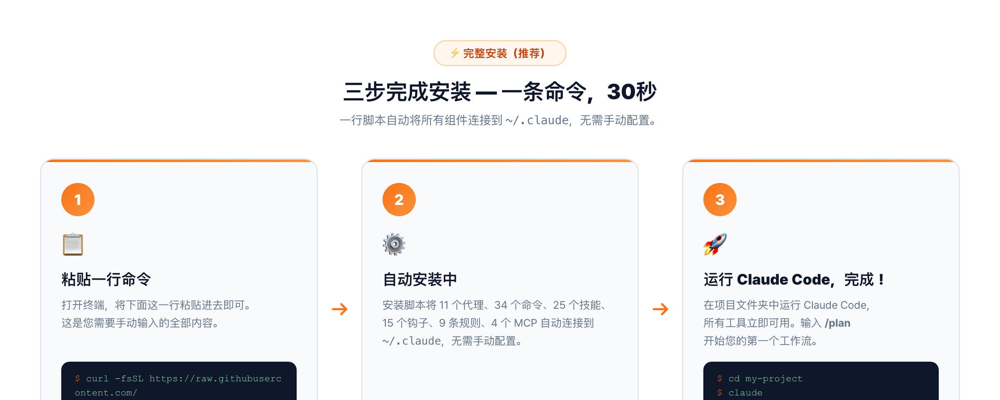
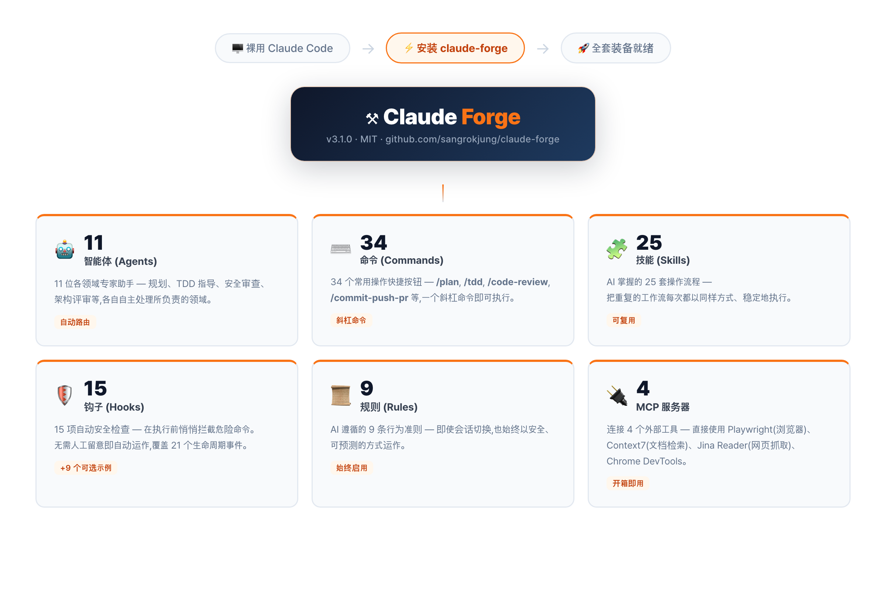
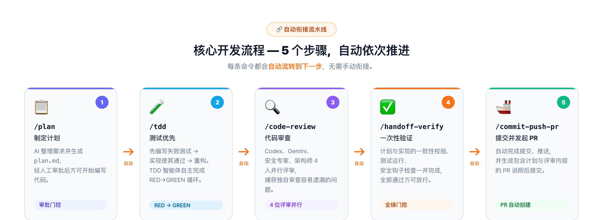
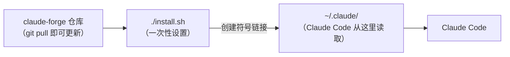

<picture>
  <source media="(prefers-color-scheme: dark)" srcset="docs/banner.jpg">
  <source media="(prefers-color-scheme: light)" srcset="docs/banner-light.jpg">
  
</picture>

<p align="center">
  <strong>Claude Code 的 oh-my-zsh — 一键安装，专业全套装备</strong>
</p>

<p align="center">
  <a href="LICENSE"></a>
  <a href="https://claude.com/claude-code"></a>
  <a href="https://github.com/sangrokjung/claude-forge/stargazers"></a>
  <a href="https://github.com/sangrokjung/claude-forge/network/members"></a>
  <a href="https://github.com/sangrokjung/claude-forge/graphs/contributors"></a>
  <a href="https://github.com/sangrokjung/claude-forge/commits/main"></a>
</p>

<p align="center">
  <a href="README.md">English</a> · <a href="README.ko.md">한국어</a> · <strong>中文</strong>
</p>

<p align="center">
  <a href="#claude-forge-是什么">这是什么</a> &bull;
  <a href="#-好在哪里">好在哪里</a> &bull;
  <a href="#-如何安装">如何安装</a> &bull;
  <a href="#-里面有什么">里面有什么</a> &bull;
  <a href="#-如何使用">如何使用</a> &bull;
  <a href="#-常见问题">常见问题</a>
</p>

> **v3.1.0 已发布（2026 年 6 月）** — 新增 **loop-forge**：把一个重复性任务一键封装成可复用、带自动校验的斜杠命令（5 种循环原型 + 自动校验器与硬停机制）。同步推出配图版新手友好 README（中/英/韩三语）。基于 v3.0 构建（钩子(自动安全检查程序) 21 事件、子智能体前置参数 v2、技能/命令混合策略、4 个 MCP 服务器基础配置）。详见 [MIGRATION.md](MIGRATION.md)。

---

## 快速安装

```bash
curl -fsSL https://raw.githubusercontent.com/sangrokjung/claude-forge/main/install.sh | bash
```

---

## Claude Forge 是什么？

**先说 Claude Code 是什么：** Claude Code 是 Anthropic（做 Claude 的那家公司）出品的 AI 编程助手，直接在你的终端里运行。它能力很强，但开箱即用的状态就像一位刚入职的新员工——会写代码，却没有公司操作规范、安全检查清单、现成模板，也没有可以随时叫来帮忙的专业同事。

**Claude Forge 就是给这位助手配备的「专业工具包」。** 一次安装，它就立刻拥有：

- **11 位领域专家**（智能体(专属 AI 助理)）：可以把任务分配给它们——规划师、安全审查员、测试向导……
- **34 个一键快捷指令**（命令(触发完整工作流的斜杠指令)）：输入 `/plan`、`/tdd`、`/code-review`，立即启动完整流程
- **25 套预置操作流程**（技能(Claude 自动跟随执行的步骤手册)）：它会自动按这些步骤走
- **15 道安全守卫**（钩子(每次操作前后自动运行的安全检查程序)）：静默拦截危险动作，无需手动干预
- **9 份行为准则**（规则文件(每次启动自动加载的 AI 行为规范)）：定义它该如何做事
- **4 个外部工具接入**（MCP 服务器(模型上下文协议，外部工具扩展接口)）：浏览器自动化、实时文档检索等

> **oh-my-zsh 类比：** oh-my-zsh 是一款免费插件，把普通终端变成功能丰富、高度定制的利器——不改变终端本身的功能，只是大幅扩展它。Claude Forge 对 Claude Code 做的事情完全一样。

---

## ✨ 好在哪里？

| 没有 Claude Forge | 有了 Claude Forge |
|:-----------------|:-----------------|
| Claude Code 能写代码，但每次都要你提醒它写测试、做安全检查、更新文档 | 自动化流水线：规划 → 测试 → 审查 → 验证 → 发布，全程连贯 |
| 没有安全网——Claude 可能运行危险命令或意外泄漏密钥 | 6 层钩子防护系统，危险动作在发生前就被拦截 |
| 一个 AI 独立包揽所有工作 | 11 位专业智能体并行协作（规划师、架构师、安全审查员……） |
| 自己从头配置要花好几个小时 | 5 分钟安装，所有组件已预先连接好 |
| 更新需要手动一个个复制粘贴文件 | `git pull` 搞定 |

---

## 📥 如何安装？



### 方式 A — Claude Code 插件市场（快速体验，功能部分支持）

打开一个 Claude Code 会话，运行两条命令：

```
/plugin marketplace add sangrokjung/claude-forge
/plugin install claude-forge
```

这样可以立即获得命令和大部分技能，但智能体、钩子、规则文件和 MCP 连接需要方式 B 才能完整启用。

日后更新：`/plugin update claude-forge`

### 方式 B — 完整安装（推荐，包含全部功能）

在终端运行一行命令：

```bash
curl -fsSL https://raw.githubusercontent.com/sangrokjung/claude-forge/main/install.sh | bash
```

也可以先克隆仓库再安装：

```bash
git clone --recurse-submodules https://github.com/sangrokjung/claude-forge.git
cd claude-forge
./install.sh           # 全新安装
# 或
./install.sh --upgrade # 从 v2.1 安全迁移（含备份与差异预览）
```

**Windows 用户：** 以管理员身份在 PowerShell 中运行 `.\install.ps1`。

### 选哪种方式？

| 功能 | 方式 A（`/plugin install`） | 方式 B（`./install.sh`） |
|:----|:---------------------------:|:------------------------:|
| 命令（34 个快捷指令）      | ✅ | ✅ |
| 技能（25 套操作流程）       | ⚠️ 部分支持 | ✅ |
| 智能体（11 位专家）         | ❌ | ✅ |
| 钩子（15 道安全守卫）       | ❌ | ✅ |
| 规则文件（9 份行为准则）    | ❌ | ✅ |
| MCP 连接（4 个外部工具）    | ❌ | ✅ |

**建议：** 除非只是想快速体验命令和技能，否则请选方式 B。

> 如果 Claude Forge 对你有帮助，在 [GitHub 上给颗星](https://github.com/sangrokjung/claude-forge/stargazers) 能让更多人发现它。

---

## 📦 里面有什么？



Claude Forge 包含的全部内容，用大白话说明：

| 组件 | 数量 | 通俗解释 |
|:----|:----:|:---------|
| **智能体**（专属 AI 助理） | 11 个 | 每个专注一个领域——规划师、架构师、安全检查员、测试向导、数据库专家等。Claude 会自动调用合适的那位。 |
| **命令**（一键快捷指令） | 34 个 | 输入 `/plan`，Claude 就生成完整实施方案；输入 `/tdd`，先写测试再写代码。34 个预置快捷键，覆盖常见开发任务。 |
| **技能**（操作步骤手册） | 25 套 | Claude 已经「背熟」的分步操作流程，会自动执行。`loop-forge` 能把任何重复任务在几秒内封装成可复用的斜杠命令。 |
| **钩子**（自动安全检查程序） | 15 个内置 + 9 个可选示例 | 在 Claude 每次操作前后运行，自动拦截泄漏的密码、危险的数据库命令和不安全的远程脚本，无需手动干预。覆盖 21 个生命周期事件。 |
| **规则文件**（行为准则） | 9 份 | 每次会话开始时 Claude 自动读取的书面规范——编码风格、安全原则、Git 工作流约定等。 |
| **MCP 服务器**（外部工具接入） | 4 个 | 浏览器自动化（Playwright）、实时库文档（context7）、网页内容读取（jina-reader）、Chrome 性能审计（chrome-devtools）。 |

---

### 🤖 11 位专家智能体

Claude 会根据任务性质自动调用合适的智能体，你不需要手动选。

**深度分析型**（使用最强模型，适合复杂判断）：

| 智能体 | 做什么 |
|:------|:------|
| **planner**（规划师） | 为复杂功能制定详细实施方案，等你确认后才动手写代码 |
| **architect**（架构师） | 设计系统结构，做扩展性决策，审查技术架构 |
| **code-reviewer**（代码审查员） | 检查代码质量、安全性和可维护性 |
| **security-reviewer**（安全审查员） | 扫描 OWASP Top 10 漏洞、泄漏密钥、注入风险 |
| **tdd-guide**（测试向导） | 执行测试优先开发：RED（失败测试）→ GREEN（通过）→ IMPROVE（重构） |
| **database-reviewer**（数据库专家） | 优化 PostgreSQL/Supabase 查询，审查 Schema 设计 |

**快速执行型**（使用轻量模型，速度更快）：

| 智能体 | 做什么 |
|:------|:------|
| **build-error-resolver**（构建错误修复） | 以最小改动修复 TypeScript 和构建错误 |
| **e2e-runner**（端到端测试执行） | 生成并运行 Playwright 浏览器测试 |
| **refactor-cleaner**（代码清理） | 用 knip、depcheck、ts-prune 发现并移除废弃代码 |
| **doc-updater**（文档同步） | 代码变更后保持文档与代码同步 |
| **verify-agent**（独立验证） | 开一个全新的上下文会话来验证构建、检查、测试是否全部通过——相当于第二双眼睛 |

---

### 🛡 6 层安全防护钩子

钩子在你的代码被每次处理前后自动运行，无需任何额外配置：

| 钩子 | 运行时机 | 拦截什么 |
|:----|:--------|:--------|
| `output-secret-filter.sh` | 每次工具调用后 | 输出中泄漏的 API 密钥、令牌、密码 |
| `remote-command-guard.sh` | Bash 命令执行前 | 危险的远程命令（curl pipe、wget pipe 等） |
| `db-guard.sh` | 数据库命令执行前 | 破坏性 SQL（无 WHERE 条件的 DROP、TRUNCATE、DELETE） |
| `security-auto-trigger.sh` | 文件编辑后 | 代码变更中潜在的安全漏洞 |
| `rate-limiter.sh` | MCP 工具调用前 | MCP 服务器被过度调用 |
| `mcp-usage-tracker.sh` | MCP 工具调用前 | 追踪 MCP 使用情况以便监控 |

额外 9 个可选示例钩子（覆盖 SessionEnd、PreCompact、SubagentStart/Stop 等更多事件）存放在 [`hooks/examples/`](hooks/examples/) 目录。完整 21 事件目录：[`hooks/README.md`](hooks/README.md)。启用方法：把 `*.example` 文件改名为 `*.sh`，然后在 `settings.json` 中注册。

---

### 🔌 4 个 MCP 外部工具接入

| 工具 | 功能 | 是否需要配置 |
|:----|:----|:-----------:|
| **playwright** | 控制真实浏览器进行端到端测试 | 无需，自动安装 |
| **context7** | 编写代码时实时获取最新库文档 | 无需，自动安装 |
| **jina-reader** | 读取网页内容并转换为干净文本 | 无需，自动安装 |
| **chrome-devtools** | 运行 Lighthouse 审计和 Core Web Vitals 检测 | 无需，自动安装 |

其余可选工具（memory 知识图谱、exa 语义搜索、GitHub、fetch）可从 [`mcp-servers.optional.json`](mcp-servers.optional.json) 按需启用。

---

## 🔄 如何使用？



### 核心开发流水线

Claude Forge 的命令专为链式协作而设计。开发任何新功能的推荐流程：

```
/plan → /tdd → /code-review → /handoff-verify → /commit-push-pr
```

| 步骤 | Claude 做什么 | 这样设计的原因 |
|:----|:------------|:-------------|
| `/plan` | 生成实施方案，等待你确认才动手写代码 | 先对齐方向，不提前动代码 |
| `/tdd` | 先写测试，再写让测试通过的代码 | 在 bug 形成前就发现问题 |
| `/code-review` | 对写好的代码做安全与质量检查 | 相当于自动代码审查 |
| `/handoff-verify` | 在全新会话中运行构建、测试和代码检查，确认全部通过 | 避免「在我机器上没问题」的陷阱 |
| `/commit-push-pr` | 提交代码、推送到 GitHub、创建 Pull Request，可选自动合并 | 一条命令完成发布全流程 |

### 其他常用工作流

**修复 bug：**
```
/explore → /tdd → /verify-loop → /quick-commit → /sync
```

**安全审计：**
```
/security-review → /stride-analysis-patterns → /security-compliance
```

**多智能体并行工作：**
```
/orchestrate → 智能体团队并行执行 → /commit-push-pr
```

### 不知道从哪里开始？

安装完成后输入 `/guide`，会有 3 分钟的交互式引导。或者直接输入：

```
/auto 登录页面
```

Claude Forge 会自动完成从规划到 PR 的全部流程。

---

## 🆕 v3.1.0 新增：loop-forge

你有没有每次都在重复同样的操作步骤？loop-forge 能把它一键变成专属斜杠命令，自带校验器和硬停保护：

- **5 种循环原型**：覆盖最常见的重复任务模式
- **自动校验器**：每次执行后自动确认结果是否正确
- **硬停机制**：检测到异常立即停止，防止错误积累

<details>
<summary><strong>v3.0 → v3.1.0 完整更新日志（点击展开）</strong></summary>

### v3.1.0（功能版，2026 年 6 月）

- **loop-forge** 技能 + 命令 — 一行重复任务变成可复用的自守护斜杠命令（5 种循环原型 + 自动校验器与硬停）。技能 24 → 25，命令 33 → 34。
- **新手友好 README** — 全面重写，面向非开发者（通俗类比、术语括号解释）+ 3 张配图（组件一览 / 三步安装 / 开发流程），英文、韩文、中文同步上线。

### v3.0.2（文档补丁，2026 年 5 月）

LLM 可读安装路径（根目录 `INSTALL.md` + 置顶一行命令）及多渠道分发。详见 [Release v3.0.2](https://github.com/sangrokjung/claude-forge/releases/tag/v3.0.2)。

### v3.0.1（补丁）

| 变更 | 说明 |
|:----|:----|
| **插件清单上线** | `/plugin marketplace add sangrokjung/claude-forge` + `/plugin install claude-forge` 现已支持命令和技能。 |
| **Chrome DevTools 升为默认** | Lighthouse / Core Web Vitals / 内存快照正式加入默认 4 个 MCP 服务器。版本固定为 `chrome-devtools-mcp@0.23.0`。 |
| **`hooks/_lib/timing.sh`** | 将 SessionEnd 钩子耗时记录到 `~/.claude/logs/hook-timing.jsonl`。 |
| **CI 扩展** | 在每个 PR 以及 `main`/`feat/**`/`fix/**`/`chore/**`/`docs/**`/`ci/**` 推送时运行，共 6 个任务。 |
| **Tier 0 规范修正** | 钩子类型、超时单位、Auto Memory 路径均已修正。 |
| **新治理文档** | ADR-001、SETTINGS-COMPATIBILITY、MARKETPLACE-SUBMISSION。 |

### v3.0（主版本）

| 变更 | 说明 |
|:----|:----|
| **钩子 21 事件** | 生命周期钩子从 5 个扩展到 21 个事件，可选示例存放于 [`hooks/examples/`](hooks/examples/)。 |
| **子智能体前置参数 v2** | 10 个可选字段：`isolation`、`background`、`memory`、`maxTurns`、`skills`、`mcpServers`、`effort`、`hooks`、`permissionMode`、`disallowedTools`。Schema：[`reference/agent-schema.json`](reference/agent-schema.json)。 |
| **技能/命令混合策略** | 清晰边界文档：[`docs/SKILLS-VS-COMMANDS.md`](docs/SKILLS-VS-COMMANDS.md)。 |
| **MCP 最小化（4 个服务器）** | 默认集：`playwright` · `context7` · `jina-reader` · `chrome-devtools-mcp@0.23.0`。旧版完整集合存于 [`mcp-servers.optional.json`](mcp-servers.optional.json)。 |
| **CLAUDE.md 模板** | 新增 [`setup/CLAUDE.md.template`](setup/CLAUDE.md.template)，支持 `@import` 模式。 |
| **一键升级** | `./install.sh --upgrade` 支持从 v2.1 安全迁移，含备份和差异预览。 |

### v3.0 破坏性变更

- **MCP 默认配置精简** — `memory`、`exa`、`github`、`fetch` 已从 `mcp-servers.json` 移除。如需恢复，从 [`mcp-servers.optional.json`](mcp-servers.optional.json) 手动添加。
- **8 个命令迁移至 `skills/`** — 保留符号链接(文件快捷方式)兼容性至 2027-04-01。涉及：`debugging-strategies`、`dependency-upgrade`、`evaluating-code-models`、`evaluating-llms-harness`、`extract-errors`、`security-compliance`、`stride-analysis-patterns`、`summarize`。
- **settings.json 白名单** — 移除 `mcp__memory`、`mcp__exa`、`mcp__github`、`mcp__fetch`，新增 `mcp__playwright`。

</details>

---

## ❓ 常见问题

<details>
<summary><strong>/sync 是什么作用？</strong></summary>

`/sync` 先从远程仓库拉取最新改动，然后同步所有项目文档——`prompt_plan.md`、`spec.md`、`CLAUDE.md` 和规则文件。建议在每个工作流（功能开发、修复 bug、重构）完成后，或每次新会话开始时运行，确保 Claude 掌握项目的最新上下文。

</details>

<details>
<summary><strong>跨会话的记忆是如何保存的？</strong></summary>

Claude Forge 使用 4 层记忆体系：

1. **项目文档**（`CLAUDE.md`、`prompt_plan.md`、`spec.md`）— 保存在仓库中的项目级说明和计划，`/sync` 保持最新。
2. **规则文件**（`rules/`）— 编码风格、安全规范、工作流约定，每次会话自动加载。
3. **MCP 记忆服务器** — 跨会话持久存储实体和关系的知识图谱（可选启用）。
4. **智能体记忆**（`~/.claude/agent-memory/`）— 核心智能体在每次任务后记录经验，持续改进后续推荐。

每次会话开始时运行 `/sync` 可确保第 1、2 层保持最新。

</details>

<details>
<summary><strong>能自定义配置吗？</strong></summary>

可以。不需要修改被 Git 追踪的文件：

```bash
cp setup/settings.local.template.json ~/.claude/settings.local.json
# 编辑 ~/.claude/settings.local.json 中的个人偏好设置
```

`settings.local.json` 会自动覆盖 `settings.json` 中的设置，`git pull` 后你的个人配置不会丢失。

</details>

<details>
<summary><strong>如何添加自定义智能体？</strong></summary>

在 `agents/` 目录下新建一个 `.md` 文件，填写智能体前置参数（frontmatter v2），就能创建专属智能体。完整字段说明见 [`reference/agent-schema.json`](reference/agent-schema.json)。

</details>

<details>
<summary><strong>如何添加自定义命令？</strong></summary>

在 `commands/` 目录下新建一个 `.md` 文件，说明该命令的用途和步骤。文件名就是斜杠命令名（例如 `my-deploy.md` 对应 `/my-deploy`）。

</details>

<details>
<summary><strong>如何启用可选钩子？</strong></summary>

在 `hooks/examples/` 目录中找到想启用的 `.example` 文件，将扩展名改为 `.sh`，然后在 `settings.json` 中注册即可。完整事件列表见 [`hooks/README.md`](hooks/README.md)。

</details>

<details>
<summary><strong>如何更新 Claude Forge？</strong></summary>

在 claude-forge 目录下运行 `git pull`。由于安装程序使用了符号链接(文件快捷方式)（macOS/Linux），更新立即生效，无需重新安装。Windows 用户需要在每次 `git pull` 后重新运行 `install.ps1` 以复制更新后的文件。

</details>

<details>
<summary><strong>Windows 上能用吗？</strong></summary>

可以。以管理员身份在 PowerShell 中运行 `install.ps1`。Windows 使用文件复制而非符号链接，因此每次 `git pull` 后需重新运行 `install.ps1` 应用更新。所有智能体、命令、技能和钩子在 Windows、macOS 和 Linux 上功能完全一致。

</details>

---

## 开发者详情

<details>
<summary><strong>34 个命令完整列表</strong></summary>

#### 核心工作流

| 命令 | 功能 |
|:----|:----|
| `/plan` | AI 生成实施方案，等待你确认后再开始编码 |
| `/tdd` | 先写测试，再写代码。每次专注一个工作单元 |
| `/code-review` | 对刚写好的代码做安全与质量检查 |
| `/handoff-verify` | 一次性自动验证构建/测试/代码检查 |
| `/commit-push-pr` | 提交、推送、创建 PR，可选合并——全部一步完成 |
| `/quick-commit` | 简单且已充分测试变更的快速提交 |
| `/verify-loop` | 最多自动重试构建/检查/测试 3 次并自动修复 |
| `/auto` | 一键自动化：从规划到 PR 全程无需停顿 |
| `/guide` | 首次使用的 3 分钟交互式引导 |
| `/loop-forge` | 把重复性任务封装为可复用的自守护斜杠命令 |

#### 探索与分析

| 命令 | 功能 |
|:----|:----|
| `/explore` | 导航和分析代码库结构 |
| `/build-fix` | 逐步修复 TypeScript 和构建错误 |
| `/next-task` | 根据项目当前状态推荐下一步任务 |
| `/suggest-automation` | 分析重复操作模式并建议自动化方案 |

#### 安全

| 命令 | 功能 |
|:----|:----|
| `/security-review` | CWE Top 25 + STRIDE 威胁建模 |
| `/stride-analysis-patterns` | 系统性 STRIDE 威胁识别方法论 |
| `/security-compliance` | SOC2、ISO27001、GDPR、HIPAA 合规检查 |

#### 测试与评估

| 命令 | 功能 |
|:----|:----|
| `/e2e` | 生成并运行 Playwright 端到端测试 |
| `/test-coverage` | 分析覆盖率缺口并生成缺失测试 |
| `/eval` | 评估驱动开发工作流管理 |
| `/evaluating-code-models` | 基准测试代码生成模型（HumanEval、MBPP） |
| `/evaluating-llms-harness` | 跨 60+ 学术基准测试 LLM |

#### 文档与同步

| 命令 | 功能 |
|:----|:----|
| `/update-codemaps` | 分析代码库并更新架构文档 |
| `/update-docs` | 从事实来源同步文档 |
| `/sync-docs` | 同步 prompt_plan.md、spec.md、CLAUDE.md 及规则文件 |
| `/sync` | 拉取最新改动并同步所有项目文档，建议在工作流完成后或会话开始时运行 |
| `/pull` | 快速执行 `git pull origin main` |

#### 项目管理

| 命令 | 功能 |
|:----|:----|
| `/init-project` | 用标准结构初始化新项目 |
| `/orchestrate` | 智能体团队并行编排 |
| `/checkpoint` | 保存/恢复工作状态 |
| `/learn` | 记录经验教训并建议自动化 |
| `/web-checklist` | 合并后的 Web 测试清单 |

#### 重构与调试

| 命令 | 功能 |
|:----|:----|
| `/refactor-clean` | 识别并移除废弃代码，含测试验证 |
| `/debugging-strategies` | 系统性调试技巧与性能分析 |
| `/dependency-upgrade` | 主要依赖升级及兼容性分析 |
| `/extract-errors` | 提取并整理错误信息 |

#### Git 工作树

| 命令 | 功能 |
|:----|:----|
| `/worktree-start` | 为并行开发创建 Git 工作树 |
| `/worktree-cleanup` | PR 完成后清理工作树 |

#### 实用工具

| 命令 | 功能 |
|:----|:----|
| `/summarize` | 总结 URL、播客、转录文本、本地文件 |

</details>

<details>
<summary><strong>25 个技能完整列表</strong></summary>

| 技能 | 功能 |
|:----|:----|
| **build-system** | 自动检测并运行项目构建系统 |
| **cache-components** | Next.js 缓存组件和部分预渲染（PPR）指南 |
| **cc-dev-agent** | Claude Code 开发工作流优化（上下文工程、子智能体、TDD） |
| **continuous-learning-v2** | 基于直觉的学习：通过钩子观察会话，创建带置信度评分的原子直觉 |
| **debugging-strategies** | 系统性调试技巧与性能分析 |
| **dependency-upgrade** | 主要依赖升级及兼容性分析 |
| **eval-harness** | 评估驱动开发（EDD）的正式评估框架 |
| **evaluating-code-models** | 基准测试代码生成模型（HumanEval、MBPP） |
| **evaluating-llms-harness** | 跨 60+ 学术基准测试 LLM |
| **extract-errors** | 提取并整理错误信息 |
| **frontend-code-review** | 前端文件审查（.tsx、.ts、.js）含检查清单规则 |
| **loop-forge** | 把一行重复任务变成可复用的自守护斜杠命令（5 种循环原型 + 自动校验器与硬停） |
| **manage-skills** | 分析会话变更，检测缺失的验证技能，创建/更新技能 |
| **prompts-chat** | 技能/提示探索、搜索与改进 |
| **security-compliance** | SOC2、ISO27001、GDPR、HIPAA 合规检查 |
| **security-pipeline** | CWE Top 25 + STRIDE 自动化安全验证流水线 |
| **session-wrap** | 会话结束清理：4 个并行子智能体检测文档、模式、学习成果、后续事项 |
| **skill-factory** | 自动将可复用的会话模式转换为 Claude Code 技能 |
| **strategic-compact** | 在合适时机建议手动压缩上下文，以保留对话空间 |
| **stride-analysis-patterns** | 系统性 STRIDE 威胁识别方法论 |
| **summarize** | 总结 URL、播客、转录文本、本地文件 |
| **team-orchestrator** | 智能体团队引擎：团队组成、任务分发、依赖管理 |
| **using-superpowers** | 在响应任何请求前发现并调用已安装的技能 |
| **verification-engine** | 集成验证引擎：全新上下文子智能体验证循环 |
| **verify-implementation** | 运行所有项目验证技能并生成统一的模式验证报告 |

</details>

<details>
<summary><strong>架构说明</strong></summary>

安装程序会从 `claude-forge` 文件夹到 `~/.claude/`（Claude Code 读取的目录）创建**符号链接(文件快捷方式)**。这意味着在仓库中执行 `git pull` 就能立即更新所有内容，无需重新安装。



> **技能 vs 命令：** `skills/` 是 Claude 自动发现并遵循的知识和操作流程；`commands/` 是你通过输入 `/名称` 主动触发的操作。详见 [docs/SKILLS-VS-COMMANDS.md](docs/SKILLS-VS-COMMANDS.md)。

**完整目录结构：**

```
claude-forge/
  ├── agents/                    智能体定义（11 个 .md 文件，前置参数 v2）
  ├── cc-chips/                  状态栏子模块
  ├── cc-chips-custom/           自定义状态栏覆盖层
  ├── commands/                  斜杠命令（34 个 .md，8 个目录已迁移至 skills/）
  ├── docs/                      截图、图表、策略文档（v3.0 指南）
  ├── hooks/                     事件驱动 shell 脚本（15 个）
  │   └── examples/              21 个生命周期事件的可选示例（9 个）
  ├── knowledge/                 知识库条目
  ├── reference/                 参考文档（含 agent-schema.json）
  ├── rules/                     自动加载的规则文件（9 个）
  ├── scripts/                   实用脚本
  ├── setup/                     安装指南 + CLAUDE.md 模板
  ├── skills/                    多步骤技能工作流（25 个，混合策略）
  ├── install.sh                 macOS/Linux 安装程序（支持 --upgrade）
  ├── install.ps1                Windows 安装程序（支持 --upgrade）
  ├── mcp-servers.json           MCP 服务器默认配置（4 个最小集）
  ├── mcp-servers.optional.json  可选 MCP 服务器（memory/exa/github/fetch/time/...）
  ├── .claude-plugin/plugin.json 插件清单（3.1.0）
  ├── .claude-plugin/marketplace.json  市场条目（3.1.0）
  ├── settings.json              Claude Code 设置（2026 字段）
  ├── MIGRATION.md               v2.1 → v3.0 迁移指南（英文）
  ├── MIGRATION.ko.md            v2.1 → v3.0 迁移指南（韩文）
  ├── CONTRIBUTING.md            贡献指南
  ├── SECURITY.md                安全策略
  └── LICENSE                    MIT 许可证
```

</details>

---

## 🤝 参与贡献

添加智能体、命令、技能和钩子的规范请见 [CONTRIBUTING.md](CONTRIBUTING.md)。

---

## 使用 Claude Forge？展示一下！

```markdown
[](https://github.com/sangrokjung/claude-forge)
```

在你的项目 README 中添加这个徽章，让其他人知道你也在用 Claude Forge。

---

## 贡献者

<a href="https://github.com/sangrokjung/claude-forge/graphs/contributors">
  
</a>

---

## 📄 许可证

[MIT](LICENSE) — 随意使用、分叉、在此基础上构建。

如果 Claude Forge 改善了你的工作流，[给颗星](https://github.com/sangrokjung/claude-forge/stargazers)能让更多人发现它。

---

<p align="center">
  <sub>由 <a href="https://github.com/sangrokjung">QJC（Quantum Jump Club）</a> 用心打造</sub>
</p>
